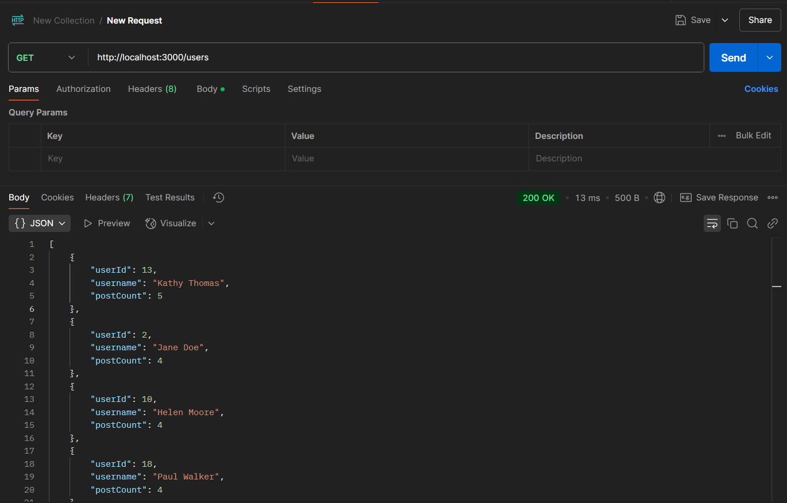

GET http://localhost:3000/users

[
    {
        "userId": 13,
        "username": "Kathy Thomas",
        "postCount": 5
    },
    {
        "userId": 2,
        "username": "Jane Doe",
        "postCount": 4
    },
    {
        "userId": 10,
        "username": "Helen Moore",
        "postCount": 4
    },
    {
        "userId": 18,
        "username": "Paul Walker",
        "postCount": 4
    },
    {
        "userId": 19,
        "username": "Quinn Scott",
        "postCount": 4
    }
]
Returns the top 5 users with the highest number of posts.

GET http://localhost:3000/posts?type=popular 

[
    {
        "id": 793,
        "userId": 1,
        "username": "John Doe",
        "content": "Post about dog",
        "commentCount": 1
    },
    {
        "id": 808,
        "userId": 1,
        "username": "John Doe",
        "content": "Post about giraffe",
        "commentCount": 1
    },
    {
        "id": 617,
        "userId": 2,
        "username": "Jane Doe",
        "content": "Post about mountain",
        "commentCount": 1
    },
    {
        "id": 686,
        "userId": 2,
        "username": "Jane Doe",
        "content": "Post about king",
        "commentCount": 1
    },
    {
        "id": 675,
        "userId": 2,
        "username": "Jane Doe",
        "content": "Post about cat",
        "commentCount": 1
    },
    {
        "id": 405,
        "userId": 2,
        "username": "Jane Doe",
        "content": "Post about piano",
        "commentCount": 1
    },
    {
        "id": 839,
        "userId": 3,
        "username": "Alice Smith",
        "content": "Post about apple",
        "commentCount": 1
    },
    {
        "id": 847,
        "userId": 3,
        "username": "Alice Smith",
        "content": "Post about cherry",
        "commentCount": 1
    },
    {
        "id": 763,
        "userId": 3,
        "username": "Alice Smith",
        "content": "Post about cherry",
        "commentCount": 1
    },
    {
        "id": 846,
        "userId": 4,
        "username": "Bob Johnson",
        "content": "Post about dog",
        "commentCount": 1
    },
    {
        "id": 328,
        "userId": 4,
        "username": "Bob Johnson",
        "content": "Post about house",
        "commentCount": 1
    },
    {
        "id": 690,
        "userId": 4,
        "username": "Bob Johnson",
        "content": "Post about whale",
        "commentCount": 1
    },
    {
        "id": 941,
        "userId": 5,
        "username": "Charlie Brown",
        "content": "Post about watermelon",
        "commentCount": 1
    },
    {
        "id": 396,
        "userId": 5,
        "username": "Charlie Brown",
        "content": "Post about jungle",
        "commentCount": 1
    },
    {
        "id": 899,
        "userId": 6,
        "username": "Diana White",
        "content": "Post about dog",
        "commentCount": 1
    },
    {
        "id": 594,
        "userId": 6,
        "username": "Diana White",
        "content": "Post about cat",
        "commentCount": 1
    },
    {
        "id": 237,
        "userId": 6,
        "username": "Diana White",
        "content": "Post about igloo",
        "commentCount": 1
    },
    {
        "id": 838,
        "userId": 7,
        "username": "Edward Davis",
        "content": "Post about ant",
        "commentCount": 1
    },
    {
        "id": 949,
        "userId": 8,
        "username": "Fiona Miller",
        "content": "Post about unicorn",
        "commentCount": 1
    },
    {
        "id": 316,
        "userId": 8,
        "username": "Fiona Miller",
        "content": "Post about island",
        "commentCount": 1
    },
    {
        "id": 118,
        "userId": 10,
        "username": "Helen Moore",
        "content": "Post about lemon",
        "commentCount": 1
    },
    {
        "id": 625,
        "userId": 10,
        "username": "Helen Moore",
        "content": "Post about vampire",
        "commentCount": 1
    },
    {
        "id": 640,
        "userId": 10,
        "username": "Helen Moore",
        "content": "Post about tiger",
        "commentCount": 1
    },
    {
        "id": 375,
        "userId": 10,
        "username": "Helen Moore",
        "content": "Post about queen",
        "commentCount": 1
    },
    {
        "id": 934,
        "userId": 11,
        "username": "Ivy Taylor",
        "content": "Post about piano",
        "commentCount": 1
    },
    {
        "id": 752,
        "userId": 11,
        "username": "Ivy Taylor",
        "content": "Post about umbrella",
        "commentCount": 1
    },
    {
        "id": 289,
        "userId": 11,
        "username": "Ivy Taylor",
        "content": "Post about dog",
        "commentCount": 1
    },
    {
        "id": 883,
        "userId": 13,
        "username": "Kathy Thomas",
        "content": "Post about cherry",
        "commentCount": 1
    },
    {
        "id": 427,
        "userId": 13,
        "username": "Kathy Thomas",
        "content": "Post about ant",
        "commentCount": 1
    },
    {
        "id": 646,
        "userId": 13,
        "username": "Kathy Thomas",
        "content": "Post about banana",
        "commentCount": 1
    },
    {
        "id": 345,
        "userId": 13,
        "username": "Kathy Thomas",
        "content": "Post about notebook",
        "commentCount": 1
    },
    {
        "id": 183,
        "userId": 13,
        "username": "Kathy Thomas",
        "content": "Post about giraffe",
        "commentCount": 1
    },
    {
        "id": 481,
        "userId": 14,
        "username": "Liam Jackson",
        "content": "Post about nest",
        "commentCount": 1
    },
    {
        "id": 273,
        "userId": 14,
        "username": "Liam Jackson",
        "content": "Post about cherry",
        "commentCount": 1
    },
    {
        "id": 876,
        "userId": 15,
        "username": "Mona Harris",
        "content": "Post about mountain",
        "commentCount": 1
    },
    {
        "id": 682,
        "userId": 15,
        "username": "Mona Harris",
        "content": "Post about fox",
        "commentCount": 1
    },
    {
        "id": 340,
        "userId": 15,
        "username": "Mona Harris",
        "content": "Post about banana",
        "commentCount": 1
    },
    {
        "id": 960,
        "userId": 16,
        "username": "Nathan Clark",
        "content": "Post about fox",
        "commentCount": 1
    },
    {
        "id": 531,
        "userId": 16,
        "username": "Nathan Clark",
        "content": "Post about apple",
        "commentCount": 1
    },
    {
        "id": 361,
        "userId": 17,
        "username": "Olivia Lewis",
        "content": "Post about monkey",
        "commentCount": 1
    },
    {
        "id": 480,
        "userId": 17,
        "username": "Olivia Lewis",
        "content": "Post about river",
        "commentCount": 1
    },
    {
        "id": 918,
        "userId": 18,
        "username": "Paul Walker",
        "content": "Post about x-ray",
        "commentCount": 1
    },
    {
        "id": 278,
        "userId": 18,
        "username": "Paul Walker",
        "content": "Post about jacket",
        "commentCount": 1
    },
    {
        "id": 180,
        "userId": 18,
        "username": "Paul Walker",
        "content": "Post about cherry",
        "commentCount": 1
    },
    {
        "id": 985,
        "userId": 18,
        "username": "Paul Walker",
        "content": "Post about nest",
        "commentCount": 1
    },
    {
        "id": 586,
        "userId": 19,
        "username": "Quinn Scott",
        "content": "Post about unicorn",
        "commentCount": 1
    },
    {
        "id": 323,
        "userId": 19,
        "username": "Quinn Scott",
        "content": "Post about piano",
        "commentCount": 1
    },
    {
        "id": 317,
        "userId": 19,
        "username": "Quinn Scott",
        "content": "Post about bat",
        "commentCount": 1
    },
    {
        "id": 581,
        "userId": 19,
        "username": "Quinn Scott",
        "content": "Post about dog",
        "commentCount": 1
    }
]
Returns posts with the most comments.

